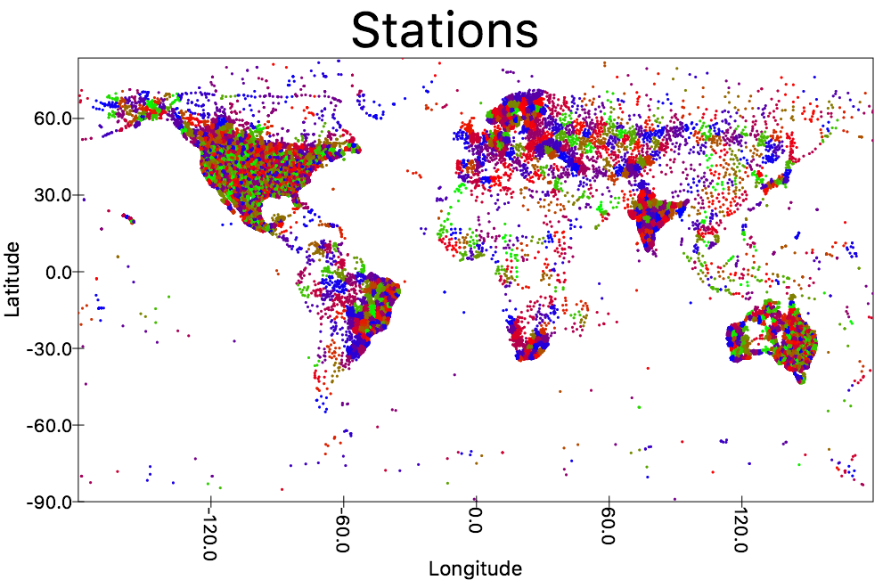

# Try Scala 2.11, Spark Apache

> This repository followed by **Mark Lewis**' tutorials for BigData Processing.

## Spark MLlib:

- [KMeans Cluster for stations location in the world](./src/main/scala/com/baoanh/LearnSPARK/sparkml/NOOAAClustering.scala)
    